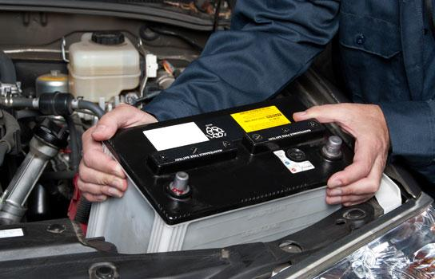

Battery Services
================

*image pulled from www.ithacaautoservice.com/portfolio-view/battery-service*

As you may know from our mission statement we only provide the best
products and services to our customers. Our battery service is only 
one of many things we provide. With low costs and very efficient 
work time , we will assure you that you get your battery changed, 
fixed, or charged as soon as you get here. Our competitors at TVG 
offer testing and charges for your car battery but we on the other 
hand DO NOT.

===========  ===========
Our Prices   TVG Prices
===========  ===========
Free         $20/Full Charge
Free         $10/Hour
===========  ===========

Why would you go to another service zone when you could just stop by 
and we would give you a FREE charge. TVG's and other service zone prices 
are too high and reports have said that they were unprofessional and very 
slow with their services such as engine replacements/fixes, tint work, detailing 
jobs, and many others. Every once in awhile check out our website for deals because 
the closer we get towards the holidays we always love to give our customers great 
deals. We also throw some events after the holidays so always be sure to check 
out our website once in awhile.
