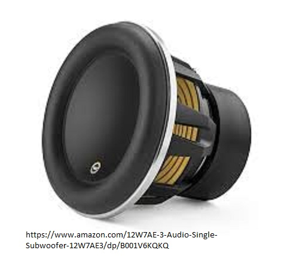

Sub woofers
===========

   Image from: Amazon.com - W7AE 12 Inch Sub

When it comes to loudness this will be your best option, along with front/back/
and tweeter speaker replacements.  Speaker replacements can do a lot for sound 
quality and loudness.  However, sub woofers unleash a different sound when it 
comes to music.  Music with normal 6-6.5” speakers only can produce mid to high 
pitch sounds. With the larger 8-15” speakers, you can install in your car, these 
low pitch sounds really stand out and bring a different quality and aspect to 
music most people have never heard before.

============  ==========  =============
Sub           Pricing     Amp-Needed?
============  ==========  =============
W7AE 8-inch   $499/Sub    Not Necessary
W7AE 10-inch  $799/Sub    Necessary
W7AE 12-inch  $849/Sub    Necessary
W7AE 13-inch  $1,299/Sub  Two Necessary
============  ==========  =============

This is where we buy our `high quality speakers`_!

.. _high quality speakers: http://www.jlaudio.com/car-audio-subwoofer-drivers-w7ae

One difficulty when it comes to Sub woofers is the wiring and powering of the 
speakers.  Most cars do not have the power to run the speakers by itself.  
Depending on the size of the speakers being installed new alternator or more car
batteries need to be installed to power the speakers adequately.  

Just like our speaker installations we can guarantee these things on Sub woofers:

   1. Lowest Price
   2. Price Match with ANY competitor
   3. Perfect Quality of speakers and installation
   4. Our 3-Year Warranty when we install it ourself
   5. A 5-Star experience and if not, a money-back guarantee
