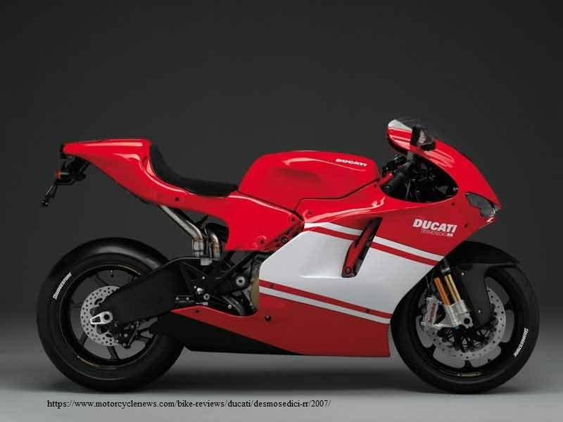
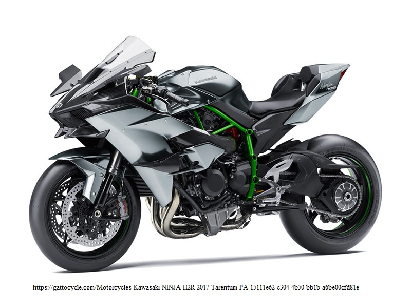
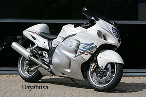

Used Motorcycles
================

Throughout our used motorcycle collection we only have some up online due to
the volume of used motorcycles. We tend to put up only the high end used bikes.

 *The first used bike on our list is a **2008 Ducati DESMOSEDICI RR** . This super 
 bike has a price of *$85,000*. There were only 1500 of these Ducati's made. 
 It has a 989cc inline 4-cylinder with a 6-speed transmission. This bike has 
 200 horsepower and 86 foot pounds of torque. Their are a lot of sweet things 
 about this bike and if you want to know more stop in or give us a call.

    
 *The second use bike we have on this list is a **2017 Kawasaki Ninja H2R** . This 
 super bike has a price tag of *$50,000*. This bike is ranked in the top 5 of 
 the fastest production made motorcycles. This bike has a 998cc 4-cylinder engine.
 It has 310 horsepower and 115 foot pounds of torque. Now this bike is truly a 
 beast that can reach speed of over 225 mph.
 

 *The third bike we have is a **2010 Suzuki Hayabusa** . This bike has a price tag of 
 *$7,000* but has the most power for the price. It has a 1,340cc 4-cylinder engine 
 pushing out 197 horsepower and 154 foot pounds of torque. Even though its only 
 *$7,000* it can still hit speeds of over 190 mph.

 .. image:: s1000rr.jpg
    :width: 400px
    :align: center
    :height: 400px
    :alt: alternate text

 *The fourth bike we have is a **2017 BMW S1000RR** . This bike has a sticker price of 
 *$15,000*. This bike is a 999cc inline 4-cylinder with a 6-speed transmission. This
 bike has 200 horsepower and 84 foot pounds of torque. This being said the top speed
 of this bike is only about 125 mph.

If you have any questions about our inventory feel free to give us a call!
